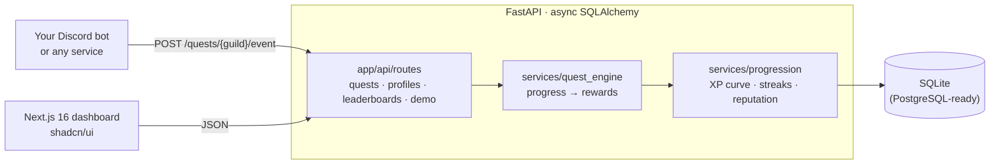

# QuestForge

**Portfolio case study:** [moeijiro.github.io/portfolio/projects/questforge](https://moeijiro.github.io/portfolio/projects/questforge/) · **Live demo:** not hosted — the app runs locally in a few commands (see below).

**Reward the members who actually help.** QuestForge replaces XP-per-message spam with
quests you design: post in the right channels, help others, show up in voice. When a
quest's goal is reached, it pays out XP, a role and a badge. Levels follow one XP curve,
leaderboards rank all-time XP, season XP or reputation, and reputation has a cooldown
so it can't be farmed.

It is the progression engine and dashboard. Your Discord bot, or any service, reports
activity to it through one API call (see
[Connecting a Discord bot](#connecting-a-discord-bot)).

> Portfolio project. The "Apex Community League" server and its members are fictional.
> Quests, profiles and progress are generated by the seed script.


| Quest board | Leaderboard |
| --- | --- |
|  |  |
| **Landing page** | **On a phone** |
|  |  |

## Contents

- [Features](#features)
- [Architecture](#architecture)
- [Progression rules](#progression-rules)
- [Security](#security)
- [API overview](#api-overview)
- [Getting started](#getting-started)
- [Demo walkthrough](#demo-walkthrough)
- [Testing](#testing)
- [Environment variables](#environment-variables)
- [Known limitations](#known-limitations)

## Features

- **Quests:**
  - Count messages, reactions, voice minutes, reputation endorsements, or a
    staff-awarded goal.
  - Categories: daily, weekly, seasonal, permanent and event.
  - Rewards: XP plus an optional role and badge.
  - Quests can be repeatable.
- **My progress:**
  - A level ring with XP to the next level, season XP, reputation and the daily streak.
  - Progress bars for every active quest, and badges.
  - A **Simulate activity** panel. Rewards appear as toasts the moment a quest
    completes.
- **Quest board:** filter by category and publish new quests from a dialog.
- **Leaderboard:** all-time, season and reputation views, with a podium for the top
  three.

## Architecture



```
backend/app
├── api/routes/     quests (+ events, progress), profiles (+ reputation), leaderboards, demo
├── models/         guild (config, season), quest (quest, progress), profile (profile, reputation log)
├── schemas/        request/response models, validated event types and categories
├── services/       quest_engine (progress and payouts), progression (levels, streaks, reputation)
├── db/             base, async session
└── seed.py         demo data: python -m app.seed [--reset]
frontend/src
├── app/            landing, (app)/dashboard, (app)/quests, (app)/leaderboard
└── components/     kit/ (shared house style), quest rewards, level ring
```

## Progression rules

- **Levels:** reaching level *L* takes ⌊100 · L^1.5⌋ XP in total. Stored levels are
  always derived from XP with the same formula the profile uses.
- **Quests:**
  - Each event adds its value to every active quest with that trigger.
  - Reaching the goal pays the XP, badge and role once.
  - **Repeatable** quests reset after completing, keeping any overflow, and pay out
    again.
- **Streaks:** activity on consecutive days extends the streak. A missed day restarts it
  at one, with no punishing decay.
- **Reputation:**
  - One endorsement per giver per `REP_COOLDOWN_HOURS`, including brand-new members, and
    no self-endorsements.
  - Endorsements count towards *reputation* quests.
- **Profiles:** a member's first event creates their profile. Reading a profile never
  does, so the leaderboard only lists real members.

## Security

| Concern | What QuestForge does |
| --- | --- |
| XP farming | Event values are bounded to 1–100 per event, and event types are validated. |
| Reputation farming | Per-giver cooldown for every giver, and no self-endorsements. |
| Phantom members | Profiles are created by activity, never by looking someone up. |
| Dashboard and event API access | **Not authenticated.** See [Known limitations](#known-limitations). |

## API overview

Interactive docs are at `http://localhost:8000/docs`. All paths start with `/api/v1`.

| Method | Path | |
| --- | --- | --- |
| GET / POST | `/quests/{guild}?category=` | List or publish quests |
| POST | `/quests/{guild}/event?user_id=&event_type=&value=` | Record activity and return any rewards unlocked |
| GET | `/quests/{guild}/progress/{user}` | The member's progress on every active quest |
| GET | `/profiles/{guild}/{user}` | Level, XP, streak, reputation, badges |
| POST | `/profiles/rep/{guild}` | Endorse a member (cooldown applies) |
| GET | `/leaderboards/{guild}?sort_by=lifetime\|season\|reputation` | Rankings |
| POST | `/demo/seed` | Load the demo server (idempotent) |

### Connecting a Discord bot

The engine is bot-agnostic. In your discord.py (or discord.js) bot, report activity as
it happens:

```python
# on_message, after your own spam filtering
await http.post(f"{API}/api/v1/quests/{message.guild.id}/event",
                params={"user_id": message.author.id, "event_type": "message",
                        "username": message.author.name})
```

The response lists the quests that just completed, with the role to grant, so the bot
can add the role and announce the reward.

## Getting started

Requirements: Python 3.12+ and Node 20+.

```bash
make install        # backend venv + frontend deps
make seed           # demo quests, profiles and progress (resets the local database)
make api            # http://localhost:8000
make web            # http://localhost:3000
```

Without make:

```bash
cd backend && python3 -m venv .venv && .venv/bin/pip install -r requirements-dev.txt
cp ../.env.example ../.env
.venv/bin/python -m app.seed --reset
.venv/bin/uvicorn app.main:app --port 8000
cd ../frontend && npm install && npm run dev
```

## Demo walkthrough

1. **My progress** shows CyberValkyrie at level 19 with quests in flight.
2. Press **Post a message** twice. *Daily Technical Contributor* completes, pays 150 XP
   and awards the *Daily Active* badge.
3. **Get endorsed by RustaceanMax** advances *Community Guide*. Pressing it again is
   refused by the cooldown.
4. **Quest board**: publish a repeatable quest. **Leaderboard**: switch between
   all-time, season and reputation.

## Testing

```bash
make test           # 11 tests
```

The tests cover:
- the XP and level formula, awarding XP and levelling up
- the reputation cooldown and the self-endorsement guard
- quest completion
- a member's first event creating their profile
- repeatable quests paying out again
- bounded event values
- profile reads staying read-only
- the reputation cooldown applying to new givers and advancing reputation quests
- demo seeding

CI runs the backend tests, then lints and builds the frontend
([.github/workflows/ci.yml](.github/workflows/ci.yml)).

## Environment variables

See [.env.example](.env.example).

| Variable | Default | |
| --- | --- | --- |
| `DATABASE_URL` | `sqlite+aiosqlite:///./questforge.db` | Any async SQLAlchemy URL |
| `CORS_ORIGINS` | `http://localhost:3000,…` | Browser origins allowed to call the API |
| `REP_COOLDOWN_HOURS` | `12` | Wait between two endorsements from the same giver |

## Known limitations

- **No sign-in, and the event endpoint is open.** Put the API behind your own auth, or
  keep it on a private network that only the bot can reach, before exposing it.
- No Discord bot ships in this repo. The engine is driven through the event API (see
  above).
- Seasons are stored but there's no season reset job yet. Season XP only grows.
- Role rewards are returned to the caller; granting them in Discord is the bot's job.

## License

MIT © Moeijiro
