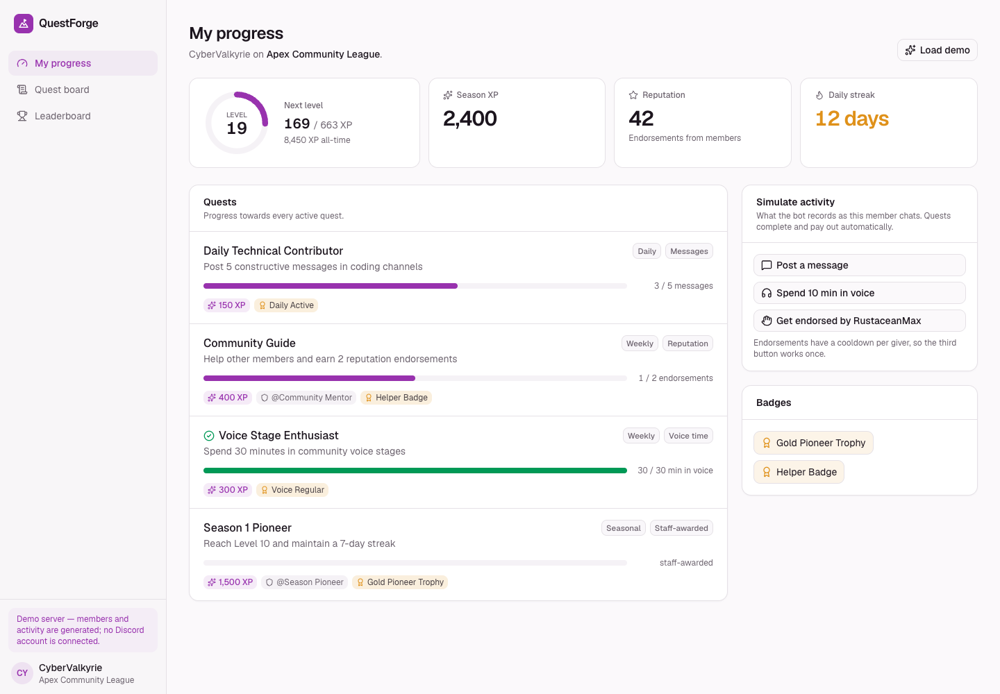
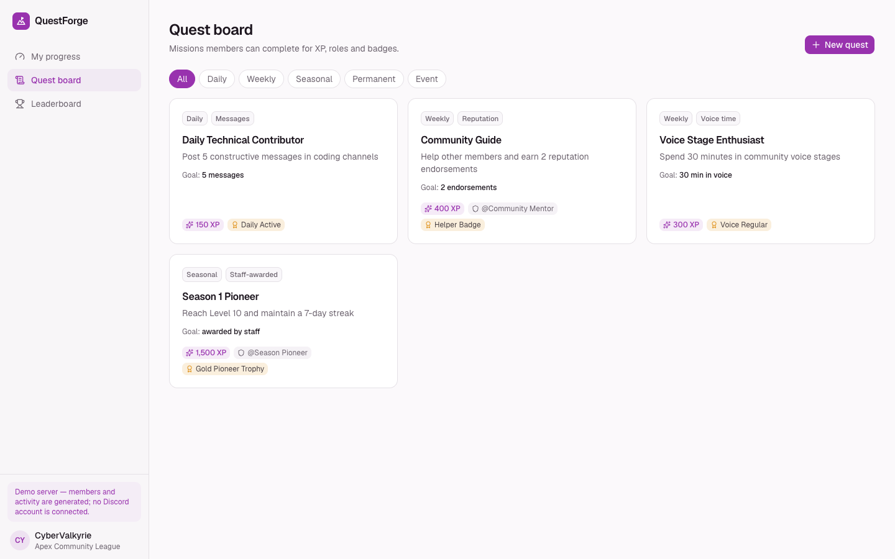
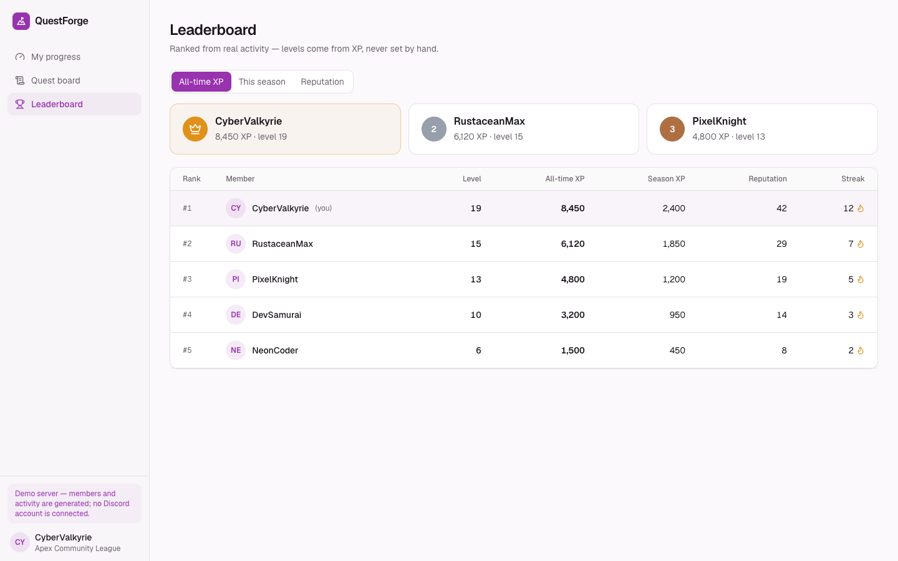
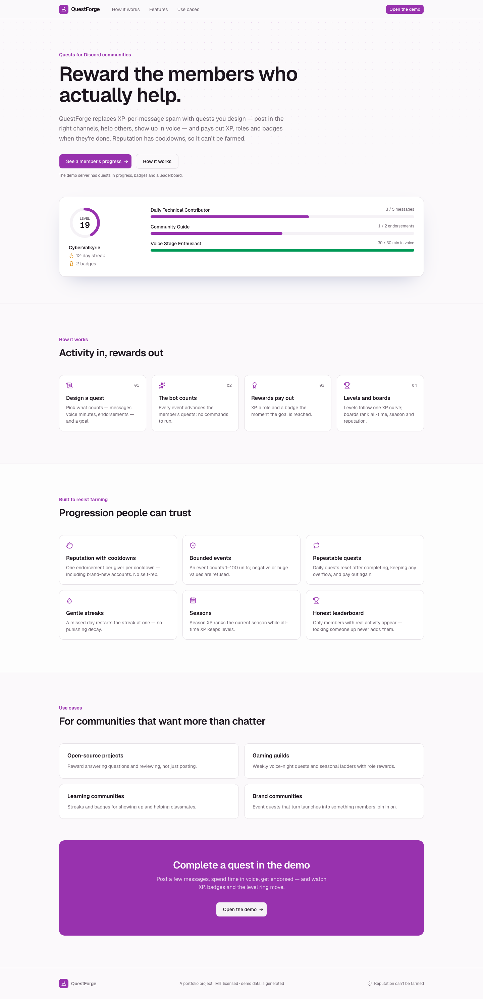
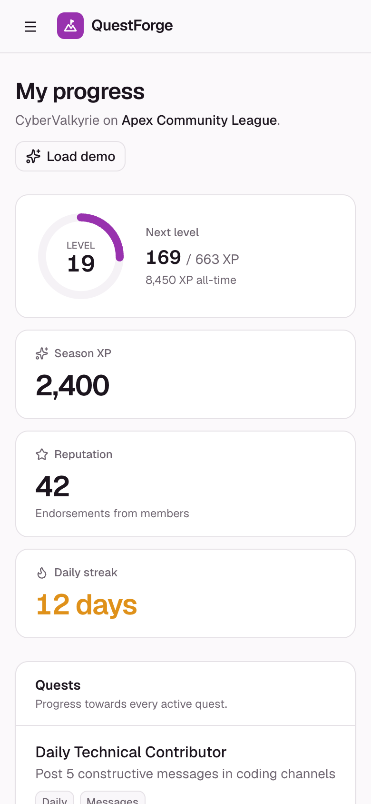
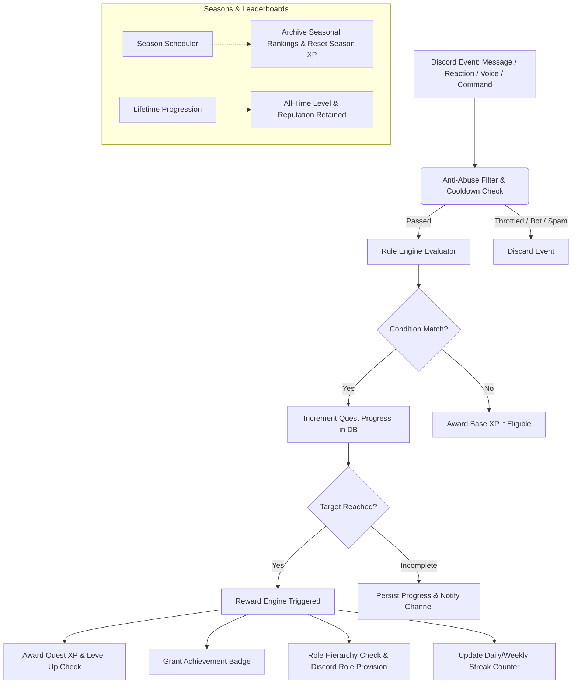

# QuestForge

[](https://github.com/Moeijiro/questforge/actions/workflows/ci.yml)
[](https://opensource.org/licenses/MIT)
[](https://fastapi.tiangolo.com/)
[](https://discordpy.readthedocs.io/)
[](https://nextjs.org/)

> **QuestForge** is an event-driven Discord missions, reputation, and progression platform. It replaces generic XP spam bots with rule-governed community quests, anti-abuse reputation transfers, seasonal resets, and automated role/badge rewards.



| Quest board | Leaderboard |
| --- | --- |
|  |  |
| **Landing page** | **On a phone** |
|  |  |

---

## Event-Driven Architecture



---

## Core Progression Mechanics

### 1. Level & XP Formula
XP thresholds scale smoothly with quadratic progression:
$$\text{XP Required for Level } L = \lfloor 100 \times L^{1.5} \rfloor$$
* **Level 1**: 0 XP
* **Level 2**: 282 XP
* **Level 5**: 1,118 XP
* **Level 10**: 3,162 XP
* **Level 25**: 12,500 XP

### 2. Safeguarded Reputation (`/rep @user`)
* **Cooldown**: 12-hour timeout between reputation endorsements.
* **Self-Rep Prevention**: Members cannot endorse their own account.
* **Daily Cap**: Maximum of 3 reputation points granted per day.
* **Audit Trail**: Optional reason string recorded for transparency.

### 3. Anti-Abuse Protections
* **Message Quests**: Requires minimum 15 characters, filters bot accounts, enforces 45-second message XP cooldowns, and ignores designated spam/bot channels.
* **Voice Quests**: Requires active, unmuted voice session lasting at least 5 continuous minutes with 2+ participants.

---

## Quest Categories & Types

| Category | Frequency | Purpose | Example |
|---|---|---|---|
| `daily` | 24 Hours | Rapid daily community engagement | "Send 5 constructive technical messages" |
| `weekly` | 7 Days | Sustained weekly milestones | "Spend 60 minutes in community voice sessions" |
| `seasonal` | 90 Days | Long-term competitive challenges | "Earn 500 reputation points during Season 1" |
| `permanent` | Once | Lifetime milestones & onboarding | "Complete onboarding & introduce your projects" |
| `event` | Manual | Staff-sponsored hackathons & stages | "Participate in Sept 2026 Community Demo Day" |

---

## Discord Slash Commands

* `/profile` — Renders an interactive member card showing level, XP bar, reputation, streak, and badges.
* `/quests` — Displays current active and completed daily/weekly quests with interactive progress bars.
* `/leaderboard` — Shows competitive rankings filtered by All-Time, Seasonal, or Reputation.
* `/rep [user] [reason]` — Endorses a helpful community member with strict anti-exploit rules.
* `/achievements` — Unrolls unlocked trophies and milestone dates.

---

## API Endpoints

| Method | Endpoint | Description |
|---|---|---|
| `GET` | `/api/v1/quests/{guild_id}` | List active, scheduled, and past quests |
| `POST` | `/api/v1/quests/{guild_id}` | Create a rule-driven quest |
| `GET` | `/api/v1/profiles/{guild_id}/{user_id}` | Member profile card data (Level, XP, Badges, Streak) |
| `POST` | `/api/v1/reputation/{guild_id}` | Endorse member with anti-abuse validation |
| `GET` | `/api/v1/leaderboards/{guild_id}` | Leaderboard rankings (All-Time, Season, Reputation) |
| `GET` | `/api/v1/seasons/{guild_id}` | Active and archived seasonal progression |
| `GET` | `/api/v1/analytics/{guild_id}` | Quest completion rates and participant velocity |
| `POST` | `/api/v1/demo/seed` | Seed realistic demo quests and leaderboard |

---

## Tech Stack

- **Backend**: Python 3.12+, FastAPI, SQLAlchemy 2.0, `discord.py 2.4`, Pydantic v2, pytest
- **Frontend**: Next.js 16, React 19, TypeScript, Tailwind CSS 4, shadcn/ui (Radix), Lucide icons, Geist
- **Database**: SQLite (Dev) / PostgreSQL (Production ready)

---

## Getting Started

### Backend Setup

```bash
cd backend
python3 -m venv .venv
source .venv/bin/activate
pip install -r requirements.txt -r requirements-dev.txt
cp .env.example .env

pytest
uvicorn app.main:app --reload --port 8000
```

### Frontend Setup

```bash
cd frontend
npm install
cp .env.example .env.local
npm run dev
```

Visit `http://localhost:3000/dashboard` and press **Load demo** (idempotent).

### Demo walkthrough

1. **My progress** shows CyberValkyrie's level ring, season XP, reputation, streak and every quest's progress.
2. Under **Simulate activity**, press **Post a message** twice — *Daily Technical Contributor* completes, pays 150 XP and awards the *Daily Active* badge.
3. **Get endorsed by RustaceanMax** advances the *Community Guide* reputation quest; pressing it again is refused by the per-giver cooldown.
4. **Quest board** lists quests by category — create one; **Leaderboard** ranks all-time XP, season XP or reputation.

### Rules the API enforces

- A member's first event creates their profile; reading a profile never does (no phantom leaderboard rows).
- Event values are bounded to 1–100 per event, and event types are validated.
- Repeatable quests reset after completing (keeping overflow) and pay out again.
- Every reputation giver is subject to the cooldown, and endorsements count towards *reputation* quests.
- Stored levels are always derived from XP with the same formula the profile uses.

---

## License

MIT © [Moeijiro](https://github.com/Moeijiro)
